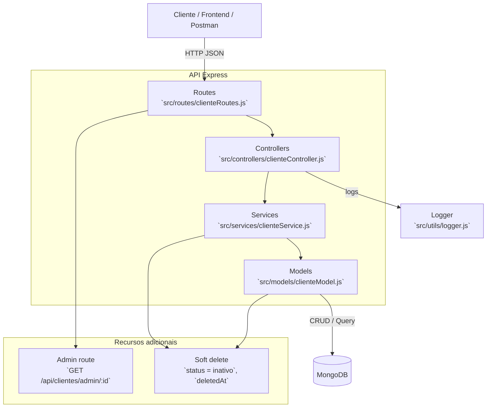

# Arquitetura da API CRUD de Clientes

Este documento descreve a arquitetura da aplicação em camadas e como as solicitações trafegam desde o cliente até o banco de dados.

## Visão Geral da Arquitetura

A API é organizada em camadas claras:
- `routes` gerencia os endpoints HTTP e encaminha para os controllers.
- `controllers` orquestram a resposta e tratam erros HTTP.
- `services` encapsulam a lógica de negócio e regras de validação.
- `models` representam o contrato de dados com o MongoDB e executam operações de persistência.

## Diagrama de Arquitetura

## Fluxo de Requisição

1. O cliente faz uma chamada HTTP para um endpoint da API.
2. A rota correspondente em `src/routes/clienteRoutes.js` dispara o controller.
3. O controller valida parâmetros, chama o serviço e formata a resposta.
4. O serviço contém regras de negócio, validações e decide a operação no modelo.
5. O modelo executa a operação no MongoDB através do Mongoose.
6. O resultado retorna ao controller e é enviado como JSON para o cliente.

## Observações

- A rota administrativa `GET /api/clientes/admin/:id` permite consultar clientes deletados logicamente.
- O soft delete atualiza `status` para `inativo` e mantém `deletedAt` preenchido.
- O logger centralizado registra contexto de endpoint, IDs e erros em `src/utils/logger.js`.
